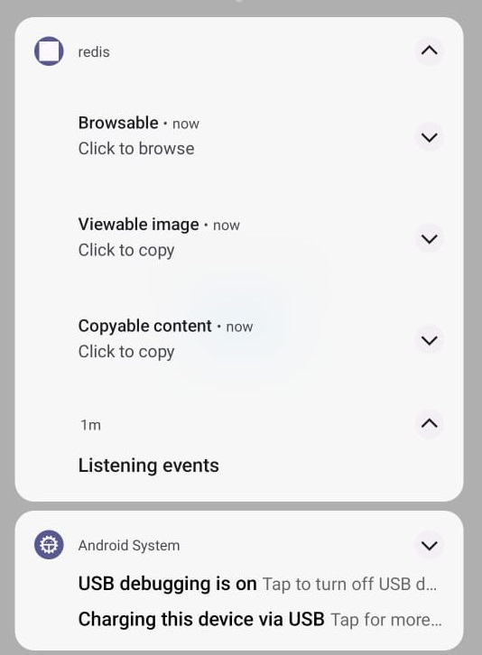

# Streamline your content sharing across platforms

## Flutter based Streamlining Content Sharing
#### Are you tired of manually copying and pasting content from your browser to your mobile device?

  - Look no further than our open-source project, which consists of a Chromium-based extension and a Flutter-based mobile app that work seamlessly together to streamline content sharing across platforms.
With our extension, you can easily send any content you come across on the web - whether it's an image, a link, or just some text - to a Redis publisher channel. 
  - Our Flutter app listens for these messages and displays them as notifications, allowing you to quickly and easily access the content on your mobile device.
Best of all, our project is completely cross-platform, meaning you can use it on any device that supports Chromium and Flutter. Whether you're a developer looking to contribute to an exciting open-source project or a user looking for a more efficient way to share content, our project has something for everyone.
  - <b>Let there be content sharing, across cross platform!</b>

### Exciting features in roadmap:

1. Add support for vice-versa content sharing, allowing users to easily send content from their mobile device to their browser.
2. Expand support for additional content types, such as videos and audio files, to make our project even more versatile.
3. Implement a stream-based connection for higher performance, enabling faster and more efficient content sharing across platforms.
4. Introduce P2P encryption-based transfer to enhance the security of our project and protect users' sensitive data.

With these exciting new features on the horizon, our open-source project is poised to become the go-to solution for seamless content sharing across platforms. Join our community today and help us shape the future of cross-platform content sharing!

### Demo notification triggered from chrome extension

### Device Initial Landing Page
You can here toggle between two states

1. Start Listen
2. Stop Listen

 

 

 

##### Stacked notification

## Controller

- [Chrome extension](https://github.com/Dixzz/redis-http-chrome-ext)

### Controller events
#### From browser send image to device seamlessly 

#### From browser send copied text

#### From browser send copied text

## Getting Started

This project is a starting point for a Flutter application.

A few resources to get you started if this is your first Flutter project:

- [Lab: Write your first Flutter app](https://docs.flutter.dev/get-started/codelab)
- [Cookbook: Useful Flutter samples](https://docs.flutter.dev/cookbook)

For help getting started with Flutter development, view the
[online documentation](https://docs.flutter.dev/), which offers tutorials,
samples, guidance on mobile development, and a full API reference.
